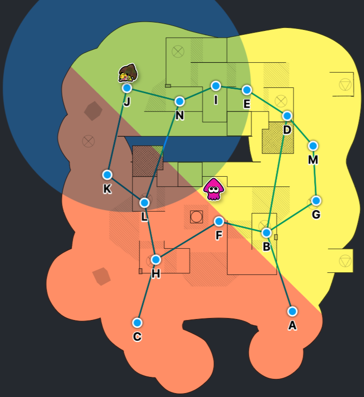
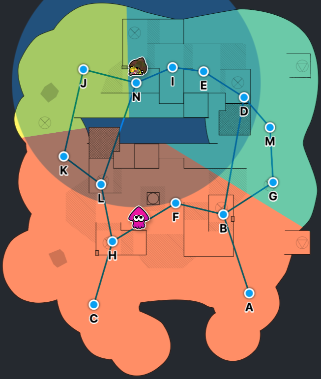
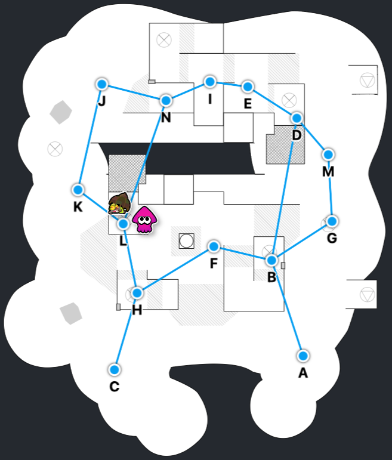
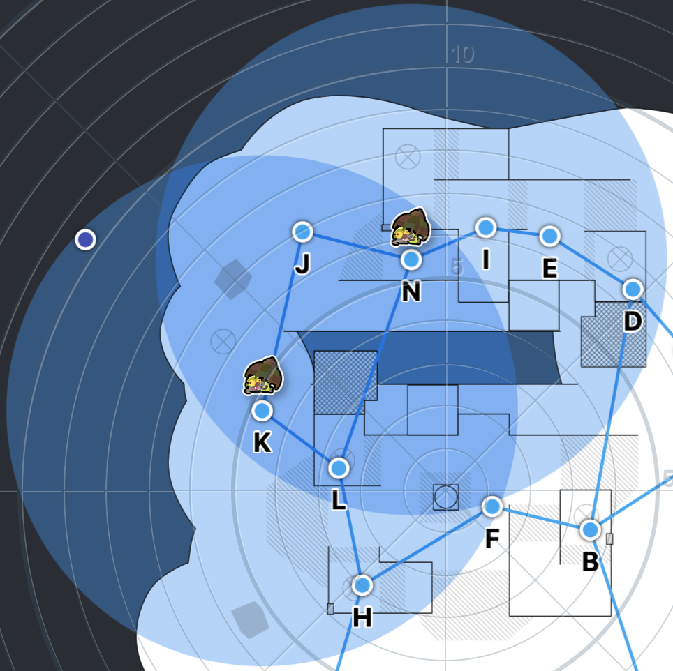
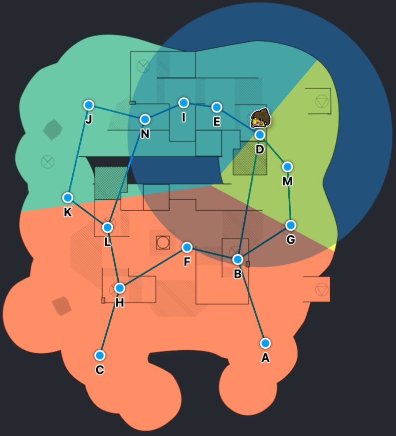
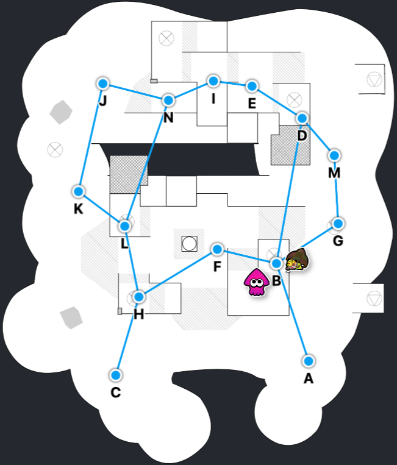
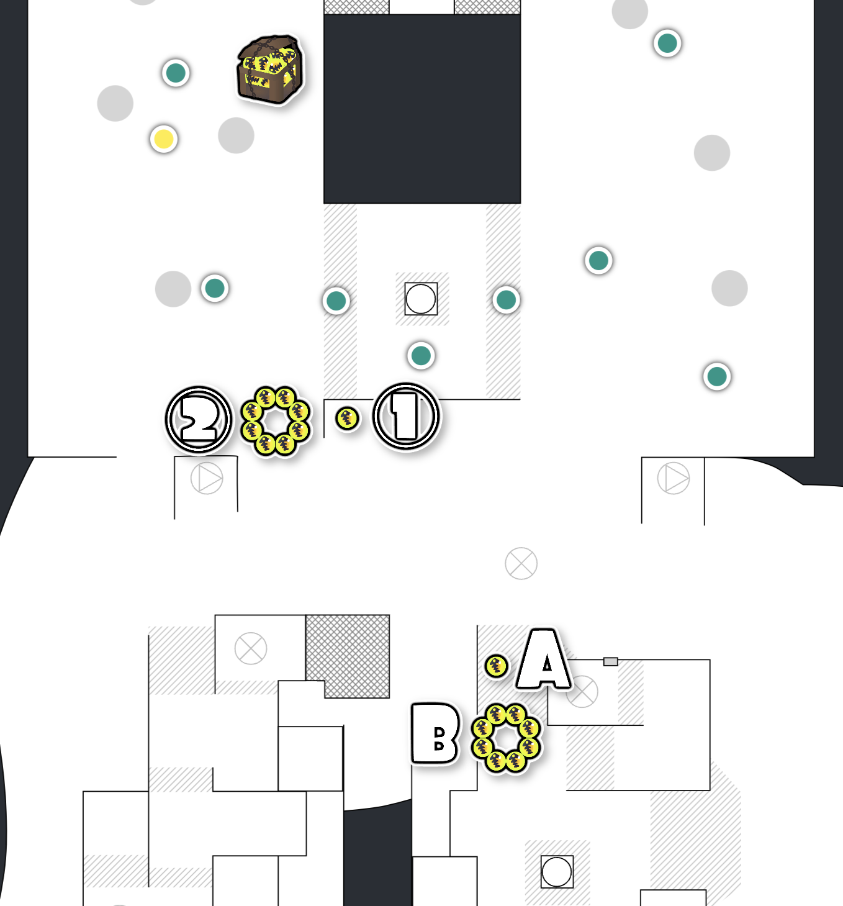

# トキシラズいぶし工房

## 昼

### 通常潮

#### コウモリ

##### 初動

###### J→N→L

###### J→K→L (非推奨)

- 着地狩りを失敗しやすい
  - KはNよりも視認性が悪い上、自岸左側全域が索敵範囲内

###### D→B

##### 初動以外

- 対岸側のコウモリ（D, E, I, J, M, N）は、原則反射で間引くのがよい
  - 対岸側に人がいる限り、自岸に飛ぶことはないボロノイ図になっている
  - D, N 以外は自岸（B, F, L, H）に飛ぶまで2手（~28秒）かかるので、管理コストが大きすぎる
- 自岸側のコウモリ（A, C, G, K）は、可能なら管理して自岸（B, F, L, H）に飛ばす
  - 管理したくない気持ちが少しでもあれば、反射して間引いてもよい

## 夜

### 干潮

### 巨大タツマキ

#### 「左の右」箱のルート

1. ①→A: 凹みに投げるルート（△）
2. ②→B: 凹みを回避して投げるルート（◎）

基本的には2のルートを採用する

- **安全**: 雑魚のスポナーから遠い
- **遠い**: 一見1のルートより遠そうだが、1 のルートは地面が凹凸している。そのため、イカ状態で移動する距離は、同じか2のほうがやや近い
- **障害物がない**: 1のルートでは仕切りの部分にイクラが落ち、投げ効率が落ちやすい
