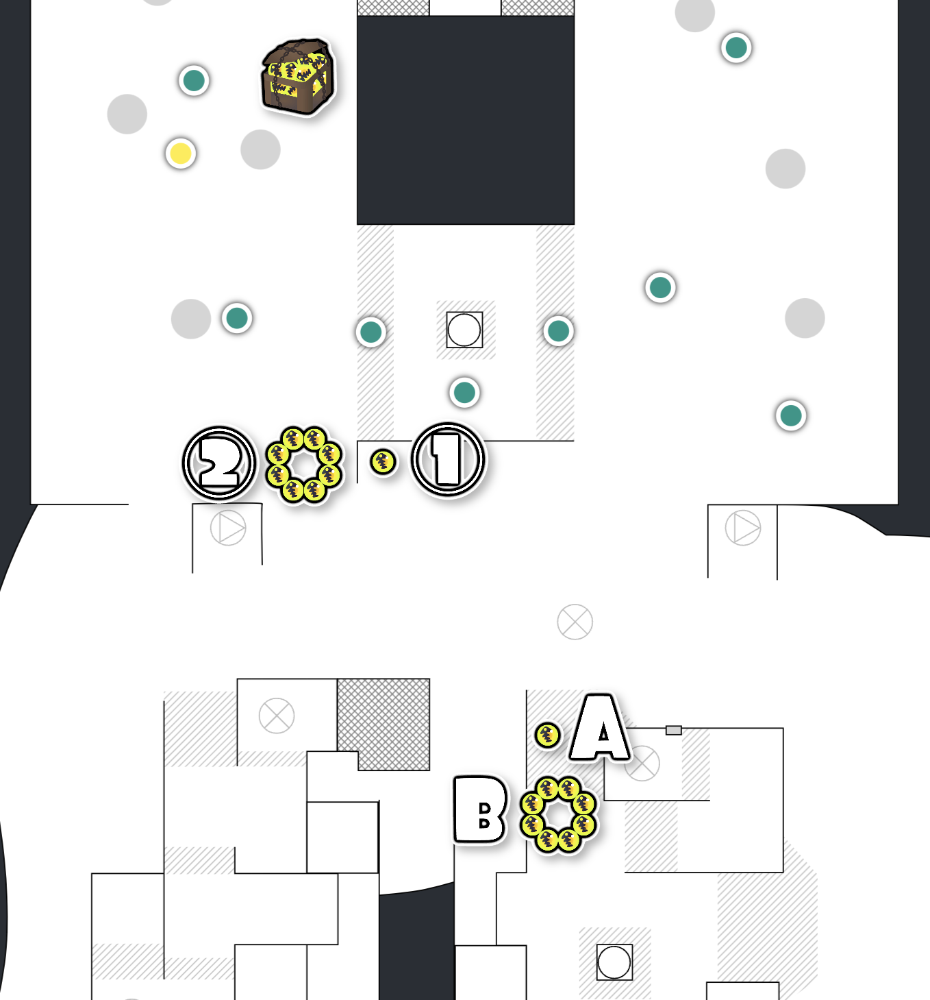

# トキシラズいぶし工房

## 夜

### 巨大タツマキ

#### 「左の右」箱のルート

1. ①→A: くぼみに投げるルート（△）
2. ②→B: くぼみを回避して投げるルート（◎）

基本的には2のルートを採用する

- **安全**: 雑魚のスポナーから遠い
- **遠い**: 一見1のルートより遠そうだが、1のルートは地面が凹凸している。そのため、イカ状態で移動する距離は、同じか2のほうがやや近い
- **障害物がない**: 1のルートでは仕切りの部分にイクラが落ち、投げ効率が落ちやすい
